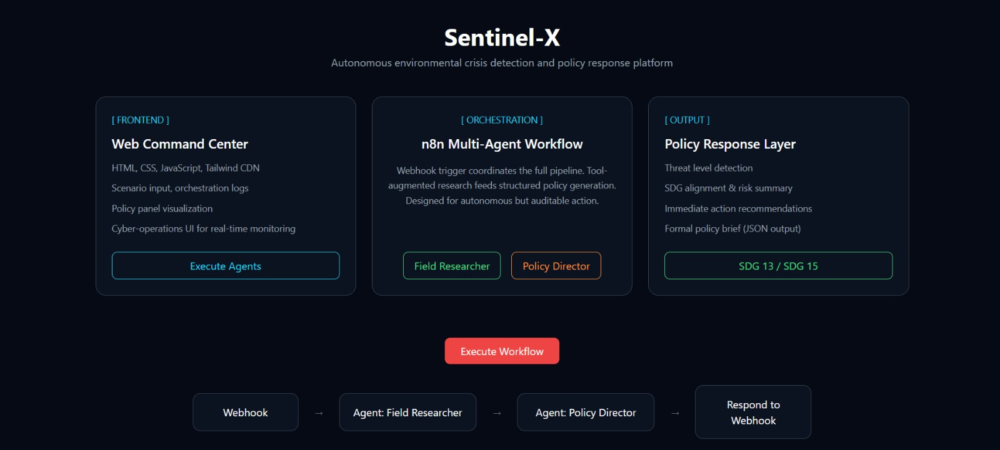
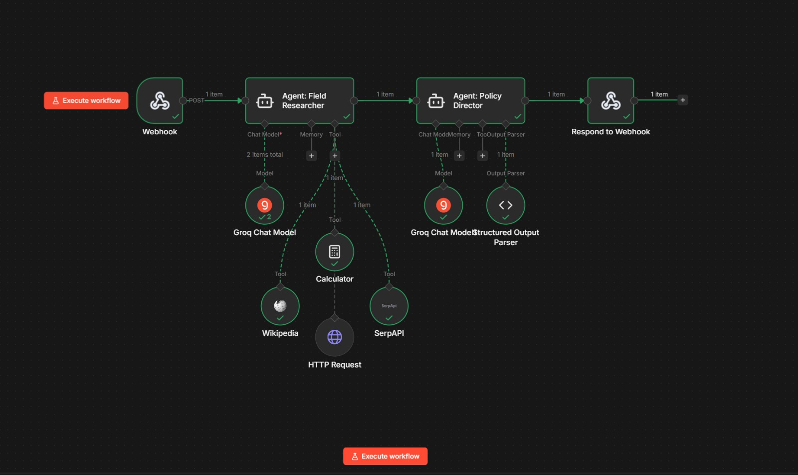
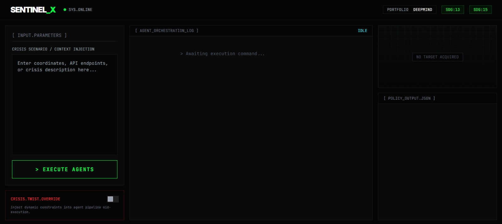

# Sentinel-X

Sentinel-X is a multi-agent autonomous ecosystem for detecting, analyzing, and responding to environmental crises, with a focus on illegal deforestation. Instead of operating as a passive dashboard, the platform uses an agentic workflow in n8n to coordinate specialized AI roles that gather evidence, verify context, and generate structured policy responses aligned with climate and land-protection goals.

This repository contains the browser-based command interface, a lightweight Node.js proxy for local webhook communication, and the exported n8n workflow that powers the agent orchestration layer.



## Abstract

Sentinel-X is a multi-agent autonomous ecosystem that detects, analyzes, and responds to environmental crises, specifically illegal deforestation, in real time. Moving beyond passive dashboards, Sentinel-X uses n8n's visual agentic workflows to coordinate two specialized AI agents: a Field Researcher Agent for data gathering, verification, and modeling, and a Policy Director Agent for decision-making, compliance framing, and alert routing. The system is designed for resilience, autonomy, and ethical governance, ensuring that automated environmental action remains accountable and aligned with international norms.

## Core Idea

The project is designed as an operational console for environmental intelligence:

- The frontend lets an operator inject a crisis scenario, monitor agent execution, and inspect structured policy outputs.
- A local Node.js proxy forwards the frontend request to an n8n webhook while handling browser CORS.
- The n8n workflow orchestrates two AI agents in sequence.
- The final response is returned to the interface as structured JSON for clear operational review.

## System Architecture



## Front End



### 1. Field Researcher Agent

The Field Researcher Agent is responsible for collecting and validating situational context. In the exported n8n workflow, this agent is connected to:

- `SerpAPI` for search-based context gathering
- `Wikipedia` for background validation
- `Calculator` for resource and logistics calculations
- `HTTP Request` for external data retrieval

Its job is strictly evidence-focused: gather facts, identify anomalies, and prepare structured research for downstream policy reasoning.

### 2. Policy Director Agent

The Policy Director Agent consumes the verified research summary and produces a strict JSON response containing:

- `threat_level`
- `sdg_alignment`
- `primary_risk`
- `immediate_action`
- `policy_brief`

The workflow instructs this agent to align outputs with:

- `SDG 13` Climate Action
- `SDG 15` Life on Land

## Tech Stack

- `HTML` for the interface structure
- `CSS` and custom styling for the visual system
- `JavaScript` for the UI logic and response rendering
- `Tailwind CSS CDN` for utility-first layout and styling
- `Node.js` for the local proxy server
- `n8n` for visual multi-agent orchestration
- `Groq-hosted models` in the exported workflow

## Repository Structure

```text
project_ananta_chkara/
|- index.html             # Main Sentinel-X interface
|- style.css              # Supplemental visual styles
|- server.js              # Local CORS/webhook proxy
|- n8n safe (1).json      # Exported n8n multi-agent workflow
|- assets/
|  |- sentinelx-overview.svg
|  `- sentinelx-workflow.svg
`- README.md
```

## Frontend Highlights

The web interface is styled as a cyber-operations dashboard and includes:

- Scenario injection panel for environmental crisis prompts
- Terminal-style orchestration log for agent execution feedback
- Policy output panel for rendered JSON responses
- Crisis override switch for injecting dynamic constraints
- Status indicators for execution, transmission, and response state

## How It Works

1. A user enters a crisis scenario in the web interface.
2. The browser sends the scenario to the local proxy at `http://localhost:3000/chat`.
3. The proxy forwards that payload to the n8n webhook.
4. The `Field Researcher Agent` gathers and validates information using connected tools.
5. The `Policy Director Agent` transforms the findings into a structured governance response.
6. n8n returns the JSON output to the frontend.
7. The interface renders both the raw response and a readable policy summary.

## Getting Started

### Prerequisites

- `Node.js 18+`
- `n8n` running locally
- Access to the APIs configured inside the n8n workflow, such as Groq and SerpAPI

### Run the Project

1. Start `n8n` and import `n8n safe (1).json`.
2. Confirm the webhook path in `server.js` matches your imported workflow.
3. Start the proxy server:

```bash
node server.js
```

4. Open `index.html` in a browser, or serve the folder with any simple static server.
5. Enter a crisis scenario and execute the agents.

## n8n Workflow Notes

The included workflow export demonstrates a clean sequential agent pattern:

- `Webhook` receives the incoming prompt
- `Agent: Field Researcher` performs evidence collection
- `Agent: Policy Director` creates a structured policy response
- `Respond to Webhook` returns JSON to the frontend

This makes the project a strong example of using n8n not just for automation, but for accountable agent orchestration.

## Use Cases

- Illegal deforestation monitoring
- Environmental compliance response simulation
- Crisis governance prototyping
- AI policy-routing demonstrations
- Multi-agent orchestration showcases for hackathons, portfolios, and research demos

## Why This Project Stands Out

Sentinel-X combines visual storytelling, live agent orchestration, and mission-driven AI design in one compact prototype. It demonstrates how frontend interfaces, lightweight backend glue, and no-code agent workflows can work together to build systems that are both technically compelling and socially relevant.

## Future Improvements

- Integrate live geospatial satellite or GIS data
- Add authentication and role-based operator access
- Store incident history and response logs
- Add real alert routing through email, messaging, or emergency channels
- Expand the ethical governance layer with explicit approval workflows

## License

This project is licensed under the MIT License. See the [LICENSE](./LICENSE) file for details.

## Author

Arpita Padhi
LinkedIn: https://www.linkedin.com/in/arpita-padhi-506a06322/